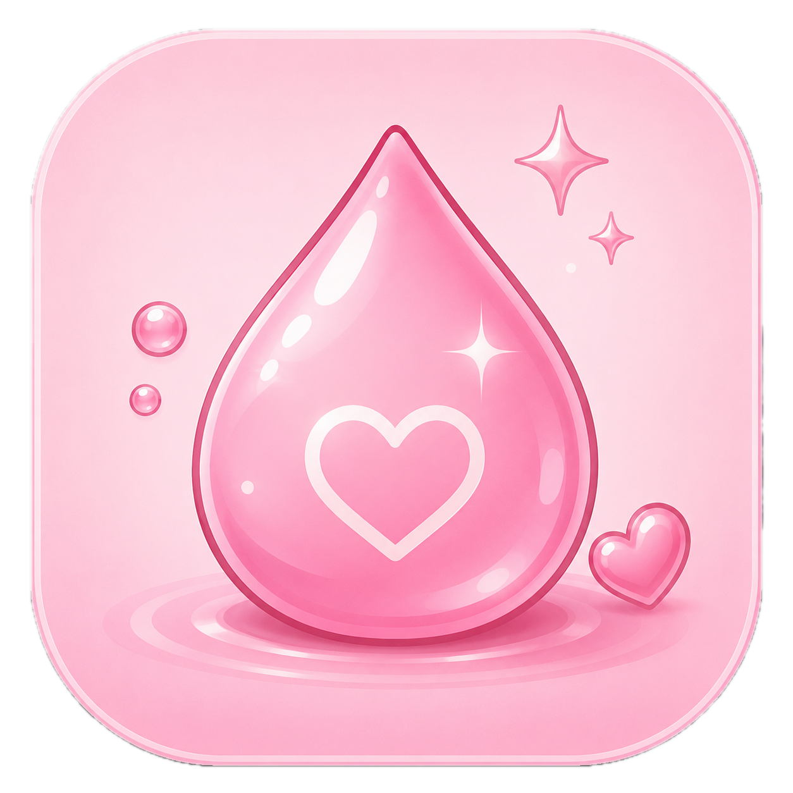
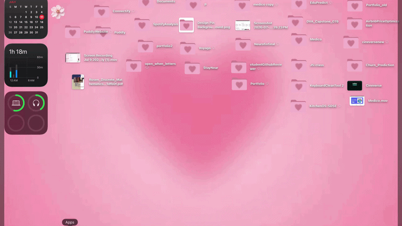

# Puddly

<p align="center">
  
</p>

<p align="center">
  <h3 align="center">Your adorable desktop hydration companion.</h3>
  <p align="center">
    Stay hydrated with gentle reminders from a cute desktop companion that lives right on your desktop.
  </p>
</p>

<p align="center">
  
  
  
  
</p>

---

## Overview

Puddly is a lightweight desktop hydration companion built with **Electron**.

Instead of sending traditional notifications, Puddly gently walks onto your desktop, reminds you to drink water with adorable animations and interactive conversations, then walks away after you respond.

The goal is simple:

> **Make staying hydrated feel delightful instead of annoying.**

---


## Features

### Hydration Reminders

- Gentle hydration reminders
- Configurable reminder intervals
- Randomized reminder messages
- Time-based messages (Morning, Afternoon, Evening & Night)

---

### Interactive Companion

- Cute animated character
- Walk-in animation
- Walk-out animation
- Multiple expressions
  - Standing
  - Waving
  - Drinking
  - Sad

---

### Interactive Conversations

Choose how to respond:

- I Drank
- Snooze

Puddly reacts with different animations and messages depending on your choice.

---

### Do Not Disturb

Pause reminders for:

- 30 Minutes
- 1 Hour
- 2 Hours
- Until Tomorrow Morning

---

### Settings

Customize:

- Reminder Interval
- Do Not Disturb
- About

---

### Desktop Experience

- Always-on-top companion
- Native system tray
- Draggable desktop companion
- Remembers window position
- Persistent user preferences

---

## Tech Stack

| Technology | Purpose |
|------------|---------|
| Electron | Desktop Application |
| JavaScript (ES6) | Application Logic |
| HTML5 | UI |
| CSS3 | Styling |

---

## Project Structure

```text
Puddly/
│
├── assets/
│   ├── icon.png
│   ├── icon.icns
│   ├── icon.ico
│   ├── standing.png
│   ├── waving.png
│   ├── drinking.png
│   ├── sad.png
│   └── walk/
│
├── main/
│   ├── main.js
│   ├── tray.js
│   ├── preferences.js
│   ├── windowBounds.js
│   └── windowDrag.js
│
├── renderer/
│   ├── character.js
│   ├── popup.js
│   ├── messages.js
│   ├── reminderEngine.js
│   ├── states.js
│   ├── script.js
│   ├── style.css
│   └── index.html
│
├── package.json
└── README.md
```

---

## Installation

### Clone the repository

```bash
git clone https://github.com/Pratiti-paul/Puddly.git
```

### Navigate to the project

```bash
cd Puddly
```

### Install dependencies

```bash
npm install
```

### Start the application

```bash
npm start
```

---

## 📦 Download

### macOS

Download the latest **DMG** from the GitHub Releases page.

### Windows

Download the latest **EXE Installer** from the GitHub Releases page.

---

## 💙 How It Works

```text
Launch App
      │
      ▼
Puddly waits quietly
      │
      ▼
Reminder timer finishes
      │
      ▼
Puddly walks in
      │
      ▼
Random hydration reminder
      │
      ▼
User chooses

💧 I Drank
      │
or
😴 Snooze
      │
      ▼
Puddly reacts
      │
      ▼
Walks away
      │
      ▼
Reminder timer restarts
```

---

## 🌸 Screenshots


### 🎥 Demo

<p align="center">
  
</p>


---

## 🚀 Roadmap

### ✅ Version 1.0

- Animated desktop companion
- Walking animations
- Interactive speech bubble
- Random reminder messages
- Time-based reminder messages
- Reminder Engine
- Native tray
- Settings
- Do Not Disturb
- Drag & Drop
- Persistent Preferences
- macOS Support
- Windows Support

---

### 🔜 Planned Features

- Idle animations
- Sound effects
- Themes
- Multiple companions
- Auto Updates
- Water streaks
- Daily statistics
- Stretch reminders
- Eye-care reminders

---

## 🤝 Contributing

Contributions, feature suggestions and bug reports are always welcome.

If you'd like to improve Puddly:

1. Fork the repository
2. Create a feature branch
3. Commit your changes
4. Open a Pull Request

---

## 📝 Known Issues

### macOS

Since Puddly is currently **not code signed or notarized**, macOS may prevent it from opening on first launch.

If you see:

> "Puddly is damaged and can't be opened"

Run:

```bash
xattr -dr com.apple.quarantine /Applications/Puddly.app
```

This is expected for unsigned applications distributed outside the Mac App Store.

---

## 📄 License

This project is licensed under the MIT License.

---

## 👩‍💻 Author

**Pratiti Paul**

Made with 💙, lots of coffee ☕ and even more water 💧.

---

<p align="center">
  If Puddly reminded you to drink water today,<br>
  don't ignore her... she's trying her best. 🥺💙
</p>